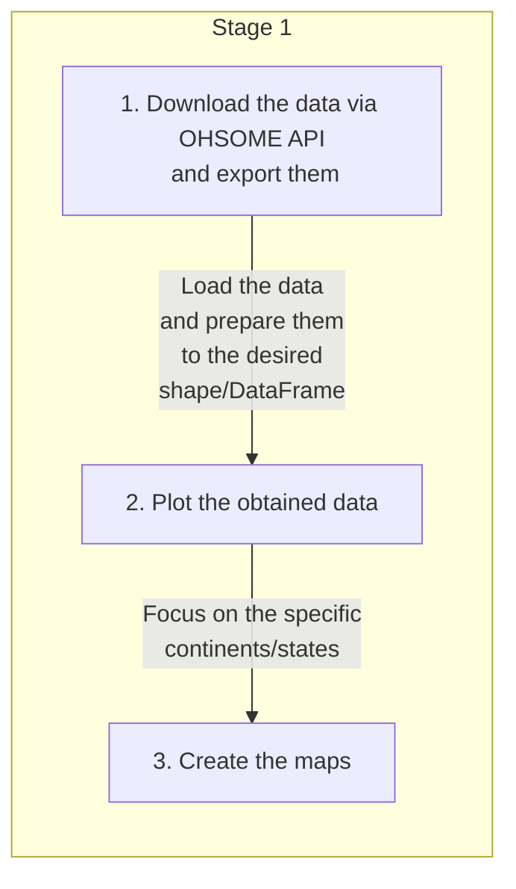

# ai-assisted-osm-mapping-stats
Find our the global scale and evolution of AI-assisted mapping in OpenStreetMap

## Introduction

AI-assisted mapping has become an increasingly important tool in humanitarian mapping efforts. With the help of AI, satellite images can be analyzed and interpreted to identify areas affected by natural disasters or conflicts, and to map out the locations of critical infrastructure, such as hospitals and schools.

In the analysis we focused on buildings and roads that were mapped from AI dataset...

Q1: How many buildings were mapped with AI? Where have the most buildings been mapped?

Q2: How many meters/kilimeters of roads were mapped with AI? Where have the most kilometers of roads been mapped?

## Workflow 
<!--[Contribution guidelines for this project](docs/CONTRIBUTING.md)-->
First of all, we downloaded the necessary data for certain regions and relevant time periods in json format via the Ohsome API. We then edited the data to create a DataFrame. We could use the obtained shape of the data to draw graphs. Based on the results from the graphs, we created maps with more detailed results.

```mermaid

flowchart TB
    subgraph Substage 1.1 and 1.2
    id1{{Workflow of the ipynb files}}


    subgraph Blds/roads
    A[1. \n notebooks-blds/roads: blds/roads-download-export-data]-- Load the data\n and prepare them \nto the desired \nshape/DataFrame -->B
    B[2. \n FIG1 \n notebooks-blds/roads: blds/roads-plot-figure-1\n or\n notebooks-blds/roads: blds/roads-plot-figure-1-beta\n \n FIG2 \n notebooks-blds/roads: blds/roads-plot-figure-2\n or\n notebooks-blds/roads: blds/roads-plot-figure-2-beta\n \n FIG3 \n blds-rel-abs-numbers-states-figure-3]-- Focus on the specific\n continents/states -->C
    C[3. Create the maps]

    click A "https://github.com/GIScience/ai-assisted-osm-mapping-stats/tree/main/notebooks-blds" _blank
    click B "https://github.com/GIScience/ai-assisted-osm-mapping-stats/tree/main/notebooks-blds" _blank
    click C "https://github.com/GIScience/ai-assisted-osm-mapping-stats/tree/main/maps" _blank

    end

    subgraph Hexagrid
    D[1. \n notebooks-blds/roads: blds-download-export-data-ver2-hexagrid]-- Load the data\n and prepare them \nto the desired \nshape -->E
    E[2. ????]-- Focus on the specific\n continents/states -->F
    F[3. Create the maps]

    click D "https://github.com/GIScience/ai-assisted-osm-mapping-stats/tree/main/notebooks-blds" _blank
    click E "https://github.com/GIScience/ai-assisted-osm-mapping-stats/tree/main/notebooks-blds" _blank
    click F "https://github.com/GIScience/ai-assisted-osm-mapping-stats/tree/main/maps" _blank

    end

    subgraph Indicators

    G[1. \n notebooks-blds/roads: blds-download-export-data-ver2]-- Load the data\n and prepare them \nto the desired \nshape -->H
    H[2. notebooks-blds/roads: blds-indicators]-- Focus on the specific\n continents/states -->I
    I[3. ???]


    click G "https://github.com/GIScience/ai-assisted-osm-mapping-stats/tree/main/notebooks-blds" _blank
    click H "https://github.com/GIScience/ai-assisted-osm-mapping-stats/tree/main/notebooks-blds" _blank
    click I "https://github.com/GIScience/ai-assisted-osm-mapping-stats/tree/main/maps" _blank

    end
end
```

## Results

Time period: 2018–2023; data per years:
- Continents:
    - During the period the highest growth of manually mapped buildings was at Europe, Asia, Africa and North America.
    - During the period the highest growth of Microsoft AI buildings was at Africa and North-Central America continents.
- States:
    - Africa:
        - During the period the highest growth of manually mapped buildings was in Tanzania, Nigeria and Uganda.
        - During the period the highest growth of Microsoft AI buildings was in Nigeria, Kenya and Tanzania.
    - North-Central America:
        - During the period the highest growth of manually mapped buildings was in the USA and Canada.
        - During the period the highest growth of Microsoft AI buildings was in the USA and Canada.
