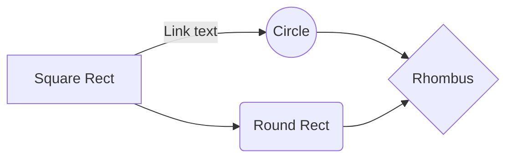

# ai-assisted-osm-mapping-stats
Find our the global scale and evolution of AI-assisted mapping in OpenStreetMap

Here is a simple flow chart:

```mermaid
graph TD;
    A-->B;
    A-->C;
    B-->D;
    C-->D;
```

```mermaid
graph LR
    A[Square Rect] -- Link text --> B((Circle))
    A --> C(Round Rect)
    B --> D{Rhombus}
    C --> D
```

  
