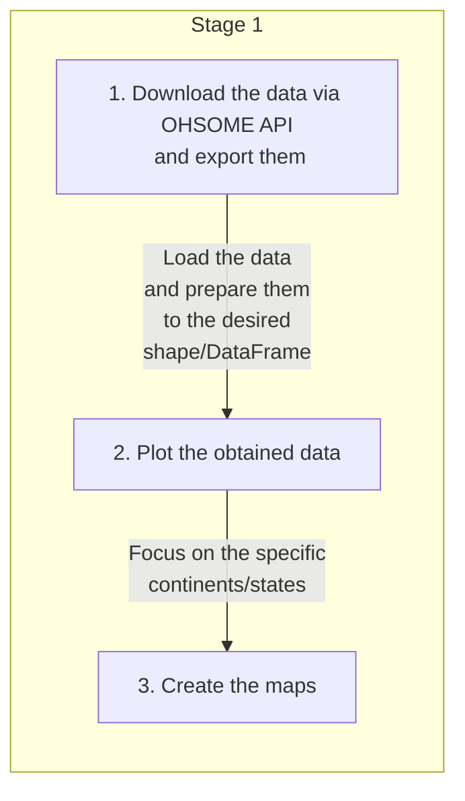

# ai-assisted-osm-mapping-stats
Find our the global scale and evolution of AI-assisted mapping in OpenStreetMap

## Introduction

In the analysis we focus on AI-assisted mapping. 
## Workflow [Contribution guidelines for this project](docs/CONTRIBUTING.md)

